# 编译原理课程实验报告

**Date : 2020-5-31**

> 课程名称：编译原理
>
> 编译器名称：MiniC
>
> 成员：
>
> ​            鞠滢        STUDENT ID：317010xxxx   计算机科学与技术
>
> ​            刘非凡    STUDENT ID：3170102894   信息安全
>
> ​            章雨婷    STUDENT ID：3170102582   信息安全
>
> 任课老师：李莹


#### 课程设计题目要求

##### 1、目的

+ 掌握词法分析，语法分析和代码生成方法

##### 2、内容

+ 用lex写出一个类C或者类PACAL某个语言的 词法分析器
+ 用YACC的分析方法完成对某一个语法分析
+ 生成语法树和中间代码
+ 生成目标代码（加分项）

##### 3、要求

+ 提交实验报告，包括词法分析部分的正规表达式描述、数据结构、原理以及实现，中间代码的格式、数据结构描述以及中间代码生成的实现（目标代码的生成）
+ 提交源代码
+ 要求结果能用可视化的方法表示出来


# Contents #

* Outline
{:toc}


## Chapter 1 : 编译器简介

### 1.1 编译器简介

​	用lex和yacc写成的一个具有解析类C语言的编译器，能够解析基础的C语言文法，并生成相应的语法树，通过语义分析形成中间代码。

### 1.2 编译器功能介绍

- 编译的功能：

  - 翻译一个语言到另一个语言
  - 输入源语言（高级语言）转变为输出的目标语言(机器码等)

- 编译流程：

  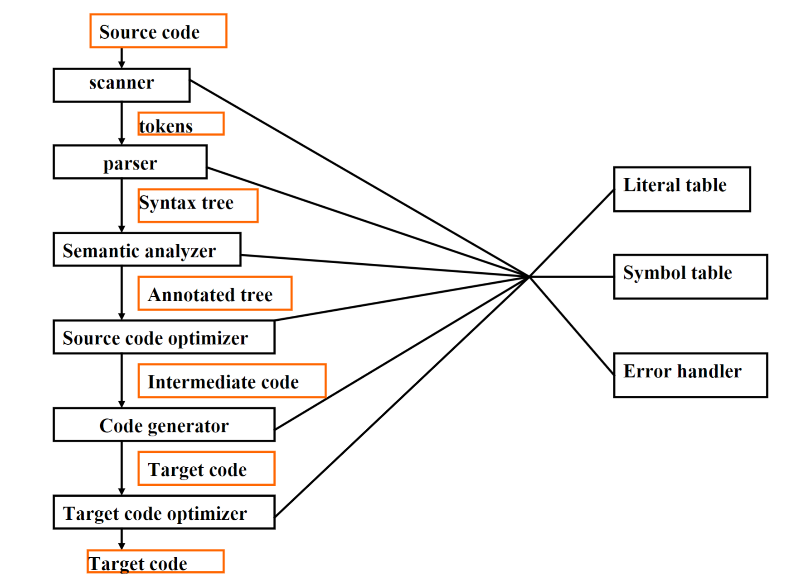

### 1.3 总体架构和运行环境

#### 1.3.1 总体架构

画代码结构调用关系图

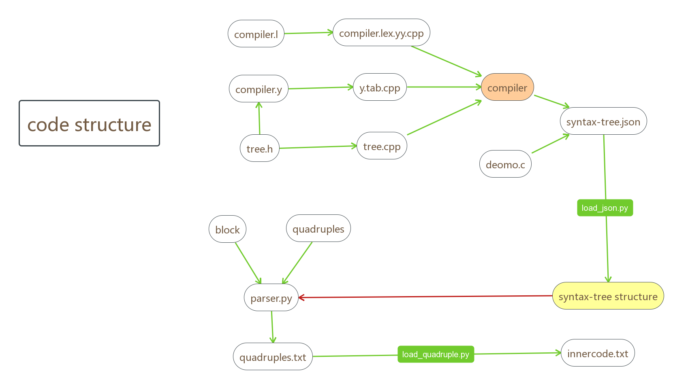

#### 1.3.2 运行环境

环境要求：flex bison g++11 python3

## Chapter 2 : 词法分析

### 2.1 总体描述

词法分析器是从左到右逐个字符地对源程序进行扫描，产生一个个的单词符号，把作为字符串的源程序改造成为单词符号串的中间程序。词法分析器部分由Lex实现。

### 2.2 正规表达式描述

#### 2.2.1  数据表示

先列实现的常量数据类型：eg. void，int，double，char

| 类别              | 内容                       |
| ----------------- | -------------------------- |
| D（数字）         | [0-9]                      |
| L（字母）         | [a-zA-Z]                   |
| H（16进制）       | [a-fA-F0-9]                |
| E（科学计数表示） | [Ee]\[+-]?{D}+             |
| P                 | ([Pp]\[+-]?{D}+)           |
| FS                | (f\|F\|l\|L)               |
| 标识符            | {L}({L}\|{D})*             |
| 整数常量          | \[1-9][0-9]*               |
| 浮点数常量        | [0-9]+\.[0-9]+             |
| 字符串常量        | L?\"(\\\\.\|\[^\\\\"\n]*\" |
| 常量              | L?.(\\\\.\|\[^\\\\'\n])+'  |
| 常量              | 0[xX]{H}+{P}{FS}?          |
| 常量              | 0[xX]{H}*"."{H}+{P}?{FS}?  |
| 常量              | 0[xX]{H}+"."{H}*{P}?{FS}?  |

正则表达式定义：

```
{L}({L}|{D})* 	{count(); yylval.gt =create_tree("IDENTIFIER",0,yylineno);	return(check_type());/*IDENTIFIER*/ }

[1-9][0-9]*	{ count(); yylval.gt =create_tree("CONSTANT_INT",0,yylineno);	return(CONSTANT_INT); /*10进制*/}

L?'(\\.|[^\\'\n])+'		{ count(); return(CONSTANT); }

[0-9]+\.[0-9]+		{ count(); yylval.gt =create_tree("CONSTANT_DOUBLE",0,yylineno);	return(CONSTANT_DOUBLE); /*浮点数*/}

0[xX]{H}+{P}{FS}?			{ count(); return(CONSTANT); }

0[xX]{H}*"."{H}+{P}?{FS}?   { count(); return(CONSTANT); }

0[xX]{H}+"."{H}*{P}?{FS}?   { count(); return(CONSTANT); }


"/*"			{ comment();/*注释*/}

"//"[^\n]*      { /* consume //-comment */ }

L?\"(\\.|[^\\"\n])*\"	{ count();  yylval.gt =create_tree("STRING_LITERAL",0,yylineno);	return(STRING_LITERAL); /*字符串常量*/
```

#### 2.2.2  关键字

| 名称                            |
| ------------------------------- |
| bool, char, int, double, void   |
| continue, break, do, while, for |
| if, else                        |
| goto, return                    |
| return                          |
| true, false                     |


#### 2.2.3  操作符

先列实现的操作符类型

| 类别       | 内容                               |
| ---------- | ---------------------------------- |
| 单目运算符 | + - ~ !                            |
| 关系运算符 | < > <= >= != ==                    |
| 算术运算符 | + - * / % \| ^ &                   |
| 逻辑运算符 | \|\| &&                            |
| 移位运算   | >> <<                              |
| 赋值运算符 | = += -= *= /= %= &= ^= \|= <<= >>= |

#### 2.2.4  注释及其他

注释表示： //    /* */

```
"/*"			{ comment();/*注释*/}

"//"[^\n]*      { /* consume //-comment */ }

[\t\v\n\f ]		{ count();}
```

## Chapter 3 : 语法分析

### 3.1 总体描述

语法分析是编译过程的核心部分。它的任务是在词法分析识别出单词符号串的基础上，分析并判定程序的语法结构是否符合语法规则。语法分析部分由YACC在基于我们定义的树的结构的基础上实现。

### 3.2 文法描述

CFG流程图：

> **Program** -> **translation_unit**

****

#### 3.2.1 转化单元

> **translation_unit** -> **external_declaration** | **translation_unit** **external_declaration**

****

#### 3.2.2 状态语句的分类：复合，表达，选择，迭代，跳转

> **statement** -> **compound_statement **| **expression_statement**| **selection_statement**| **iteration_statement**| **jump_statement**

* 复合

> **compound_statement ** -> '{' '}' | '{' **block_item_list** '}'
>
> **block_item_list** ->  **block_item** | **block_item_list** **block_item**
>
> *block_item** -> **declaration** | **statement**

 * 表达

> **expression_statement** -> ';'  | **expression** ';'

 * 选择

> **selection_statement** -> IF '(' **expression** ')' **statement** %prec LOWER_THAN_ELSE | IF '(' **expression** ')' **statement** ELSE **statement**

 * 迭代

> **iteration_statement** -> WHILE '(' **expression** ')' **statement**| DO **statement** WHILE '(' **expression** ')' ';'| FOR '(' **expression_statement** **expression_statement** ')' **statement**| FOR '(' **expression_statement** **expression_statement expression** ')' **statement**| FOR '(' **declaration expression_statement** ')' **statement**| FOR '(' **declaration expression_statement expression** ')' statement

 * 跳转

> **jump_statement** ->CONTINUE ';'| BREAK ';'| RETURN ';'| RETURN **expression** ';'

****

#### 3.2.3 外部函数声明

> **external_declaration** -> **function_definition** | **declaration**

****

#### 3.2.4 函数定义

> **function_definition** -> **type_definition declarator declaration_list compound_statement**| **type_definition** **declarator compound_statement**

****

#### 3.2.5 声明部分

 * 声明列表

> **declaration_list** ->  **declaration** | **declaration_list declaration**

 * 声明部分

> **declaration** -> **type_definition** ';'| **type_definition init_declarator_list** ';'

 * 类型定义

> **type_definition** -> VOID | CHAR | INT | DOUBLE | BOOL

 * 初始化声明列表

> **init_declarator_list** ->**init_declarator**| **init_declarator_list ',' init_declarator**

 * 初始化声明

> **init_declarator** ->**declarator**| **declarator** '=' **initializer**

 * 声明

> **declarator** ->IDENTIFIER| '(' **declarator** ')'| **declarator** '[' **assignment_expression** ']'| **declarator** '[' '*' ']'| **declarator** '[' ']'| **declarator** '(' **parameter_list** ')'| **declarator** '('**identifier_list** ')'| **declarator** '(' ')'

****

#### 3.2.6 初始化部分

 * 初始化格式

> **initializer** ->**assignment_expression**| '{' **initializer_list** '}'| '{' **initializer_list** ',' '}'

 * 初始化列表

> **initializer_list** ->**initializer**| **designation initializer**| **initializer_list** ',' **initializer**| **initializer_list** ',' **designation initializer**

> **designation** -> **designator_list**
>
> **designator_list** -> **designator** | **designator_list designator**
>
> **designator** ->   '[' **logical_or_expression** ']' | '.' IDENTIFIER

****

#### 3.2.7 参数部分

 * 参数列表

> **parameter_list** ->**parameter_declaration**| **parameter_list** ',' **parameter_declaration**

 * 参数声明

> **parameter_declaration** ->**type_definition declarator**| **type_definition abstract_declarator**| **type_definition**

 * 标识符列表

> **identifier_list** ->IDENTIFIER| **identifier_list **',' IDENTIFIER

> **abstract_declarator** -> '(' **abstract_declarator** ')'| '[' ']'| '[' **assignment_expression** ']'| **abstract_declarator** '[' ']'| **abstract_declarator** '[' **assignment_expression** ']'| '[' '*' ']'| **abstract_declarator** '[' '*' ']'| '(' ')'| '(' **parameter_list** ')'| **abstract_declarator** '(' ')'| **abstract_declarator** '(' **parameter_list** ')'

****

#### 3.2.8 表达式部分

> **expression** -> **assignment_expression** | **expression** ',' **assignment_expression**

 * 赋值表达式

> **assignment_expression** -> **logical_or_expression **| **monocular_expression** **assignment_operator** **assignment_expression**

> **assignment_operator** -> '='|MUL_ASSIGN|DIV_ASSIGN|MOD_ASSIGN|ADD_ASSIGN|SUB_ASSIGN|LEFT_ASSIGN|RIGHT_ASSIGN| AND_ASSIGN|XOR_ASSIGN|OR_ASSIGN 

 * 逻辑表达式

> **logical_or_expression** -> **logical_and_expression** | **logical_or_expression** OR_OP **logical_and_expression**

> **logical_and_expression** -> **bitwise_or_expression** | **logical_and_expression** AND_OP **bitwise_or_expression**

> **bitwise_or_expression** -> **xor_expression** | **bitwise_or_expression** '|' **xor_expression**

> **xor_expression** -> **and_expression **| **xor_expression** '^' **and_expression**

> **and_expression** -> **equaljudge_expression** | **and_expression** '&' **equaljudge_expression**

> **equaljudge_expression** -> **compare_expression **| **equaljudge_expression** EQ_OP **compare_expression** | **equaljudge_expression** NE_OP **compare_expression**

> **compare_expression** -> **shift_expression **| **compare_expression** '<' **shift_expression** | **compare_expression** '>' **shift_expression** | **compare_expression** LE_OP **shift_expression** | **compare_expression** GE_OP **shift_expression**

 * 移位表达式

> **shift_expression** -> **addsub_expression **| **shift_expression** LEFT_OP **addsub_expression** | **shift_expression** RIGHT_OP **addsub_expression**

 * 算数表达式

> **addsub_expression** -> **muldiv_expression** | **addsub_expression** '+' **muldiv_expression**| **addsub_expression** '-' **muldiv_expression**

> **muldiv_expression** -> **monocular_expression** | **muldiv_expression **'*' **monocular_expression** | **muldiv_expression** '/' **monocular_expression **| **muldiv_expression** '%' **monocular_expression**

 * 一元表达式 

> **monocular_expression**>**postfix_expression**| INC_OP **monocular_expression**| DEC_OP **monocular_expression**| **monocular_operator monocular_expression**

> **monocular_operator** ->'+'| '-'| '*'| '~'| '!'

 * 后缀表达式

> **postfix_expression** -> **basic_expression** | **postfix_expression '[' expression ']'**| **postfix_expression '(' ')'**| **postfix_expression '(' argument_expression_list ')'**| **postfix_expression INC_OP**| **postfix_expression DEC_OP**

 * 参数表达式

> **argument_expression_list**->**assignment_expression**|**argument_expression_list**',' **assignment_expression**

 * 基础表达式

> **basic_expression** ->IDENTIFIER| TRUE| FALSE| CONSTANT_INT| CONSTANT_DOUBLE| '(' expression ')'

### 3.3 数据结构

#### 3.3.1 语法树结构定义

SyntaxTree定义：

```C
struct SyntaxTree
{
    string content;
    string name;
    int line; 
    int number; 

    struct SyntaxTree *child;
    struct SyntaxTree *sibling;
};
```

content存储树的注释，即语义分析用到的变量的值等；树的结构采用 first-child next-sibling的结构 

#### 3.3.2 函数说明

语法树每个函数功能描述：

```c
struct SyntaxTree *create_tree(string name, int num, ...);

void free_tree(SyntaxTree *node);
void print_tree(SyntaxTree *root, FILE *fp);
void analysis_tree(struct SyntaxTree *head, int leael);
void traverse_tree(SyntaxTree *node, ofstream &outfile);

void write_to_file(SyntaxTree *root, string path);
```

| 函数          | 功能              |
| ------------- | ----------------- |
| create_tree   | 创建树节点        |
| free_tree     | 释放语法树        |
| traverse_tree | 遍历语法树        |
| analysis_tree | 分析打印树content |
| print_tree    | 打印出语法树      |
| write_to_file | 将树结构写入文件  |

### 3.4 原理及实现

.y和tree.cpp调用模式

```sh
# build.sh
if [ ! -d "dist" ]; then
  mkdir dist
fi

flex --outfile=dist/compiler.lex.yy.cpp compiler.l
yacc --output=dist/y.tab.cpp -d compiler.y

cp tree.cpp dist/tree.cpp
cp tree.h dist/tree.h
cd dist

echo '#include"tree.h"\n' | cat - y.tab.hpp > y.tab.hpp.temp && rm y.tab.hpp && mv y.tab.hpp.temp y.tab.hpp
g++ -std=c++11 -o compiler tree.cpp compiler.lex.yy.cpp y.tab.cpp
```

语法树例子和图：

例如demo.c为

```c
int main()
{
    int a[10];

    int i;
    for (i=1;i<5;i++)
        a[i] = i + 1;

    for (i=1;i<5;i++)
        print(a[i]);

}
```

生成的语法树的图为：

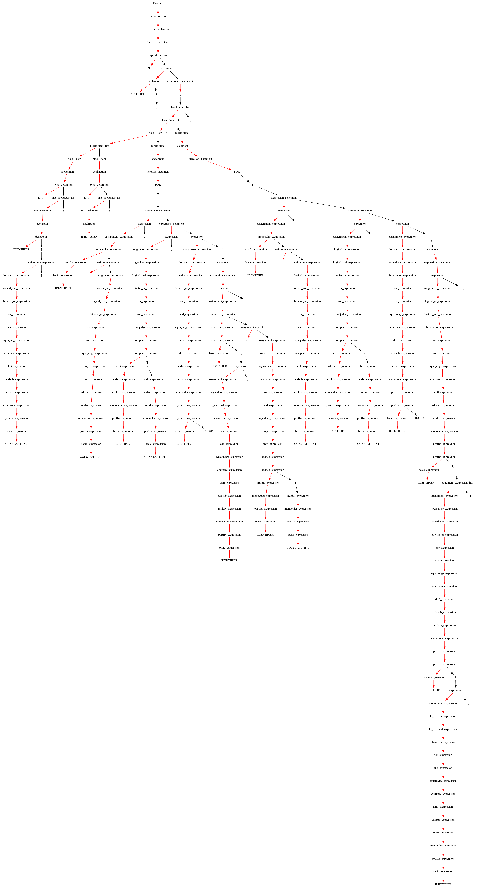

## Chapter 4 : 语义分析

### 4.1 总体描述

​	语义分析是编译过程的一个逻辑阶段， 语义分析的任务是对结构上正确的源程序进行上下文有关性质的审查，进行类型审查。语义分析是审查源程序有无语义错误，为代码生成阶段收集类型信息。
​	语义分析的地位是编译程序最实质性的工作；第一次对源程序的语义作出解释，引起源程序质的变化。

### 4.2 数据结构

#### 4.2.1 数据结构定义

##### 4.2.1.1 作用域变量管理

```python
class Block:
    def __init__(self, name="", type="", num=-1):
        self.func = funcNode()
        self.is_func = False
        self.varMap = {}
        self.arrayMap = {}
        self.label_bk = ""
        self.can_bk = False
```

Block这个类的作用是描述一个作用域主要用于管理这个作用域中的变量、标签和（函数信息），包括变量信息，函数信息，数组信息。

| 变量名   | 作用                 |
| -------- | -------------------- |
| func     | 函数结构体           |
| is_func  | 是否是函数块         |
| varMap   | 变量名和变量节点映射 |
| arrayMap | 数组名和数组节点映射 |
| label_bk | 跳转的标记名         |
| can_bk   | 是否需要跳转         |

##### 4.2.1.2 变量信息

```python
class varNode:
    def __init__(self):
        self.name = ""
        self.type = ""
        self.num = -1
        self.use_addr = False
        self.bool_exp = ""
```

varNode类的作用是储存变量信息。

| 变量名   | 作用                                   |
| -------- | -------------------------------------- |
| name     | content或者临时变量名                  |
| type     | 数据类型                               |
| num      | 变量数量                               |
| use_addr | 是否是数组, 数组类型则赋值为True       |
| bool_exp | 存储返回值为bool的表达式 ">= <= == !=" |

##### 4.2.1.3 数组信息

```python
class arrayNode:
    def __init__(self):
        self.name = ""
        self.type = ""
        self.num = -1
```

arrayNode的作用是存放数组信息，包括数组大小、命名等。

| 变量名 | 作用     |
| ------ | -------- |
| name   | 数组名   |
| type   | 数组类型 |
| num    | 数组长度 |

##### 4.2.1.4 函数信息

```python
class funcNode:
    def __init__(self):
        self.name = ""
        self.re_type = ""
        self.para_list = []
```

funcNode的作用是存放函数名称，返回类型和变量参数等。

| 变量名    | 作用                      |
| --------- | ------------------------- |
| name      | 函数名                    |
| re_type   | 返回类型                  |
| para_list | 参数结点，存储的是varnode |

##### 4.2.1.5 语义分析类

```python
class Parser:
    funcPool = None
    blockStack = None
    root = None
```

​	root表示从json文件读入的经过语法分析后的语法树，在此基础上构建的SyntaxTree数据结构以便于自下而上的语义分析。

​	blockStack表示一个符号表栈，Block这个类的作用是描述一个作用域主要用于管理这个作用域中的变量、标签和（函数信息），这个list模仿了Block的进栈出栈模式。

​	fucPool存储源码中的函数定义和声明。

#### 4.2.2 语义分析实现

语义分析主要任务是分析源程序的含义并做出相应的语义处理。语义处理主要包含两个部分：

* 静态语义检查

  类型检查，控制流检查，唯一性检查，其它相关的语义检查

* 语义翻译

  生成与硬件机器相对独立的中间语言代码

##### 4.2.2.1 语义翻译与符号表栈

符号表栈的处理包括作用域的进栈与出栈，以及对语法树的属性翻译和属性计算以解析整个语法树的具体语义，并协助翻译中间码，具体符号表栈的分析将在中间码介绍。

##### 4.2.2.2 静态语义检查

MiniC编译器主要实现三类语义错误检查：

* 类型确定与类型检查
* 控制流检查
* 唯一性检查

错误检查具体功能实现如下：

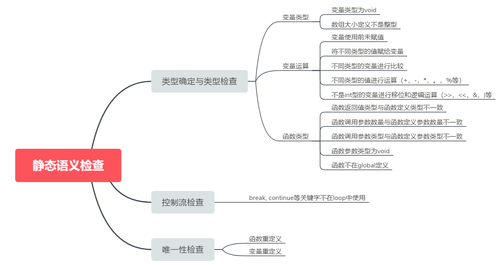

###### 4.2.2.2.1 类型确定与类型检查

类型定义包含变量或函数使用前是否经过定义。

```python
if (rnode.num < 0):
	self.error(primary_exp.child.line,
               "Undefined variable " + content)

...

if (funcName not in self.funcPool):
	self.error(post_exp.child.child.child.line,
               "Undefined function " + funcName)
```

类型检查包含，运算符两边的变量是否可以进行计算，对数据进行的处理是否符合数据本身特性，函数返回值是否和定义函数返回值匹配，函数输入参数与定义参数类型不匹配或数量不匹配等等。

```python
if (funcName not in self.funcPool):
	self.error(post_exp.child.child.child.line,
               "Undefined function " + funcName)

...


elif op == 'MOD_ASSIGN':
	if node1.type != 'int' or node2.type != 'int':
		self.error(assign_exp.child.line,
                   "The two variables should be int.")

...

if rnode.type != funcType:
	self.error(node.child.sibling.line, 
               "return type error! doesn't match function return type.")
```

类型确定样例：

（这里以函数未定义为例）

```c++
int main()
{
    int a[10];
    function(a);
}
```

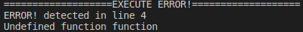

类型检查样例：

（这里以函数实际返回值与定义不符为例）

```c++
int function()
{
    return 1.1;
}
int main()
{
    int para;
    para = function();
}
```

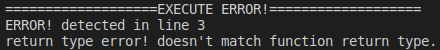

###### 4.2.2.2.2 控制流检查

控制流中每个节点代表一个基本块，例如，没有任何跳跃或跳跃目标的直线代码块；跳跃目标以一个块开始，和以一个块结束。在控制流检查过程中，如果先前没有定义跳转的代码块，则会对其进行报错：

```python
elif node.child.name == "BREAK":
	num = self.getBreakBlockNumber()
	if num < 0:
		self.error(node.child.line, "break statement not within a loop..")
```

控制流检查样例：

```c++
int main()
{
    int a[10];
    break;
}
```

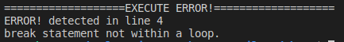

###### 4.2.2.2.3 唯一性检查

c语言中对函数名的要求是唯一的，不存在两个名称相同的函数名，在编译器语义分析时需要对函数名进行是否重复定义的分析：

```python
if self.funcPool[funcName].isdefinied:
	self.error(declarator.child.child.line, "Function " +
                           funcName + " has been defined before.")
```

唯一性检查样例：

```c++
int function()
{
    int a = 1;
}
int function()
{
    int a = 2;
}
int main()
{
    int a[10];
}
```

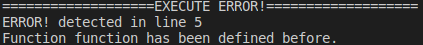

## Chapter 5 : 中间代码

### 5.1 总体描述


### 5.2 中间代码格式说明

| Grammer                       | Description                                                  |
| ----------------------------- | ------------------------------------------------------------ |
| LABEL label_name :            | 声明标签                                                     |
| left := right                 | 赋值语句                                                     |
|                               | right: var binomial_op var \| var \| unary_op var \| *temp \| &temp \| array_element \| CALL f(var1,var2,var3...) |
|                               | var: temp \| constant                                        |
|                               | left: temp \| array_element \| *temp                         |
|                               | array_item: temp[var]                                        |
|                               | temp必须只含有小写英文字母、数字、下划线，且首字符是字母     |
| GOTO label1                   | 无条件跳转至标签处                                           |
| IF var GOTO label1            | 条件语句                                                     |
| IFNOT var GOTO label1         | 条件语句                                                     |
| RETURN var                    | 函数返回                                                     |
| MALLOC var1[size]             | 申请大小为size的内存空间，并将申请到的连续内存首地址赋给var1 |
| CALL f (var1,var2,var3...)    | 调用函数并不需要返回值                                       |
| Function f(var1,var2,var3...) | 声明函数f                                                    |

### 5.3 数据结构

#### 5.3.1 数据结构定义

符号表 各种操作


#### 5.3.2 算法


### 5.4 原理及实现

例子


## Chapter 6 : 运行方式和结果

### 6.1 运行方式

```
~ bash build.sh
~ bash test.sh
~ python load_json.py
~ python load_quadruples.py
```

### 6.2 demo结果

#### 6.2.1 运算符测试

源码：

```c++
int main()
{
    int a, b, result;
    a = read();
    b = read();


    result = a + b;
    print(result);

    result = a - b;
    print(result);

    result = a * b;
    print(result);

    result = a / b;
    print(result);

    result = a % b;
    print(result);

    a++;
    b++;
    print(a);
    print(b);
    
}
```

语法树：

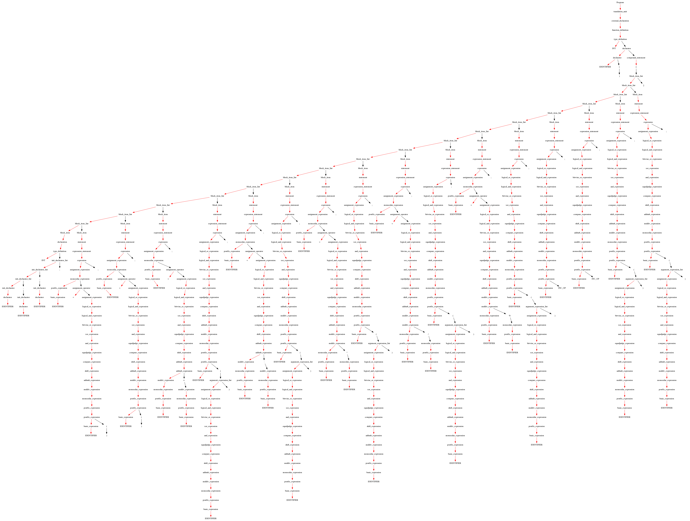

中间码：

```
FUNCTION main :
temp0 := #10
temp2 := #4
temp1 := temp2 * temp0
temp2 := #1
var0 := temp2
LABEL lab :
temp3 := #5
temp4 := var0 <= temp3
IF var0 GOTO temp3
GOTO goto
LABEL lab :
temp7 := #4
temp6 := var0 * temp7
temp5 := &var0 + temp6
temp8 := #1
temp9 := var0 + temp8
temp5 := temp9
GOTO goto
LABEL lab :
temp10 := #1
var0 := temp10
LABEL lab :
temp11 := #5
temp12 := var0 <= temp11
IF var0 GOTO temp11
GOTO goto
LABEL lab :
temp15 := #4
temp14 := var0 * temp15
temp13 := &var0 + temp14
ARG temp13
CALL print
GOTO goto
LABEL lab :
```

#### 6.2.1 选择语句测试

```c++
int main()
{
    int a, b, result;
    a = read();
    b = read();

    if (a > b)
    {
        result = a - b;
        print(result);
    }
    else if(a == b)
    {
        result = a - b;
        print(result);
    }
    else
    {
        result = b - a;
        print(result);
    }
}
```

语法树：

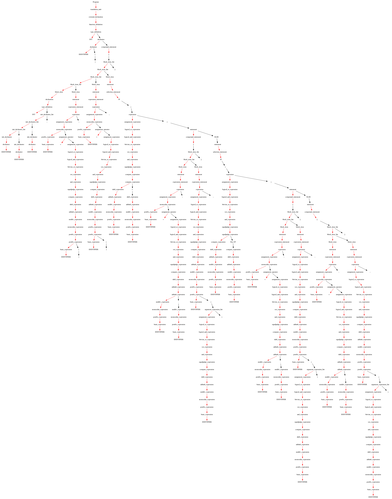

中间码：

```
FUNCTION main :
var0 := CALL read
var1 := CALL read
temp2 := var0 >= var1
IF var0 GOTO var1
GOTO goto
LABEL lab :
temp3 := var0 - var1
var2 := temp3
ARG var2
CALL print
GOTO goto
LABEL lab :
IF var0 GOTO var1
GOTO goto
LABEL lab :
temp5 := var0 - var1
var2 := temp5
ARG var2
CALL print
GOTO goto
LABEL lab :
temp6 := var1 - var0
var2 := temp6
ARG var2
CALL print
LABEL lab :
LABEL lab :
```

#### 6.2.3 循环语句测试

```c++
int main()
{
    int a[10], i, result;
    for (i=1;i<10;i++)
    {
        a[i] = i;
        print(a[i]);
    }

    i = 10;
    while(i>1)
    {
        print(a[i]);
        if(a[i]<5)
        {
            break;
        }
    }
}
```

语法树：

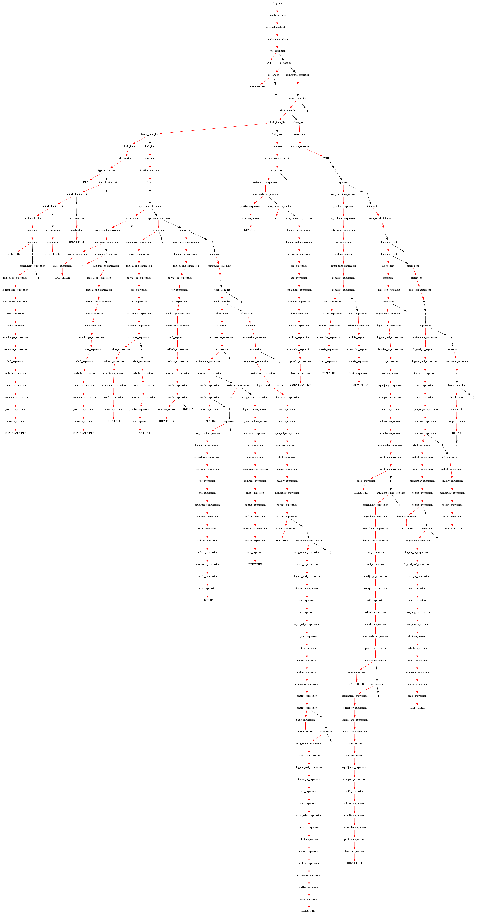

中间码：

```
FUNCTION main :
temp0 := #10
temp2 := #4
temp1 := temp2 * temp0
temp2 := #1
var0 := temp2
LABEL lab :
temp3 := #10
temp4 := var0 <= temp3
IF var0 GOTO temp3
GOTO goto
LABEL lab :
temp7 := #4
temp6 := var0 * temp7
temp5 := &var0 + temp6
temp5 := var0
temp10 := #4
temp9 := var0 * temp10
temp8 := &var0 + temp9
ARG temp8
CALL print
GOTO goto
LABEL lab :
temp11 := #10
var0 := temp11
LABEL lab :
temp12 := #1
temp13 := var0 >= temp12
IF var0 GOTO temp12
GOTO goto
LABEL lab :
temp16 := #4
temp15 := var0 * temp16
temp14 := &var0 + temp15
ARG temp14
CALL print
temp19 := #4
temp18 := var0 * temp19
temp17 := &var0 + temp18
temp20 := #5
temp21 := temp17 <= temp20
IF temp17 GOTO temp20
GOTO goto
LABEL lab :
GOTO goto
LABEL lab :
GOTO goto
LABEL lab :
```

#### 6.2.4 函数与递归

源码：

```c++
int fact(int i) {
    if (i <= 1) {
        return 1;
    }
    else{
        return i * fact(i - 1);
    }
}
int main() {
    int i;
    int times;
    times=read();
    for(i = 1; i < times + 1; i++)
    print( fact(i) );
    return 0;
}
```

语法树：

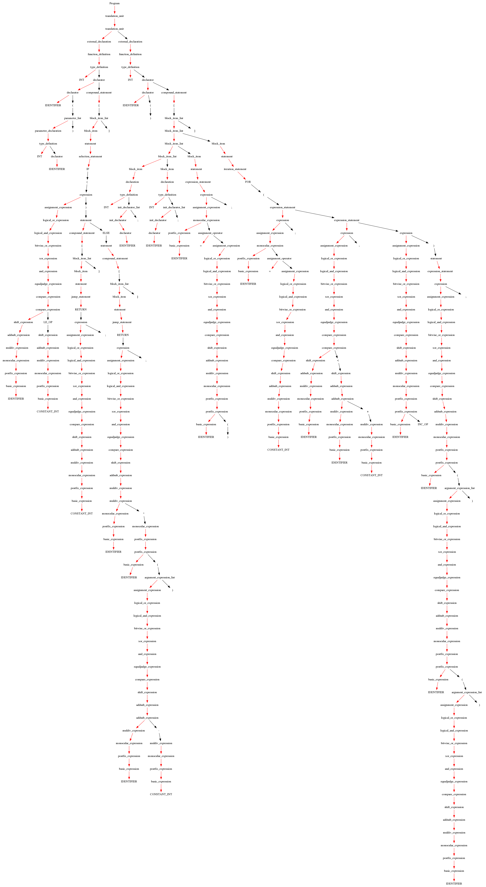

中间码：

```
FUNCTION fact :
PARAM var0
temp0 := #1
temp1 := var0 <= temp0
IF var0 GOTO temp0
GOTO goto
LABEL lab :
temp2 := #1
RETURN temp2
GOTO goto
LABEL lab :
temp3 := #1
temp4 := var0 - temp3
ARG temp4
temp5 := CALL fact
temp6 := var0 * temp5
RETURN temp6
LABEL lab :
FUNCTION main :
var2 := CALL read
temp8 := #1
var1 := temp8
LABEL lab :
temp9 := #1
temp10 := var2 + temp9
temp11 := var1 <= temp10
IF var1 GOTO temp10
GOTO goto
LABEL lab :
ARG var1
temp12 := CALL fact
ARG temp12
CALL print
GOTO goto
LABEL lab :
```


## Chapter 7 : 开发困难及解决方案

### 7.1 困难1

* 困难

  

* 解决方案

  

### 7.2 困难2

* 困难

  

* 解决方案

  

### 7.3 困难3

* 困难

  

* 解决方案

  

### 7.4 困难4

* 困难

  

* 解决方案

  


## Chapter 8 : 总结

MiniC基本实现了C语言的部分常用功能，能够进行正确的词法、语法、语义分析并生成语法树进行可视化以及中间码。

未实现的功能还有很多，例如：

* 结构体
* 指针
* 外部函数调用
* ……

在实验中，对词法和语法分析有了更深刻的了解，能熟练运用lex和yacc进行操作，同时，对语义分析和错误纠正也有一定的了解。结合课程所学知识，能够通过语法树转化成四元码并生成中间码。在未来，我们将会对MiniC编译器进行优化与改善以实现更多功能。
